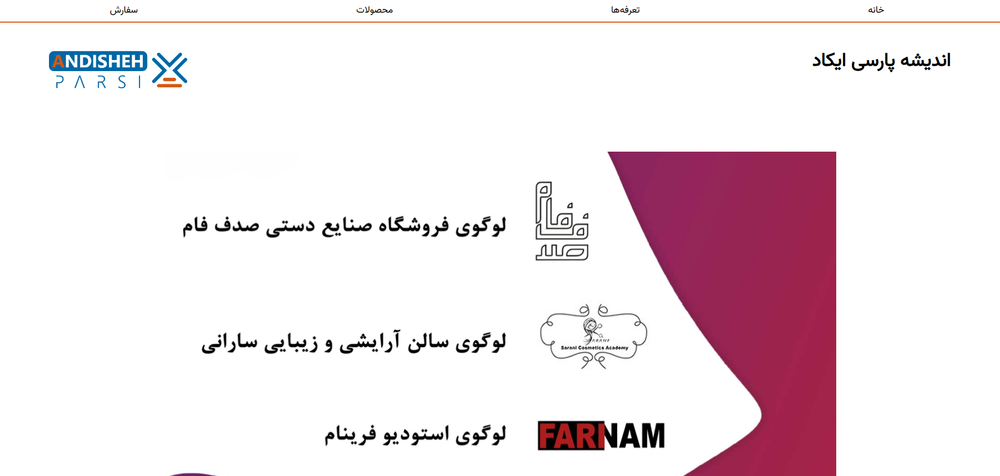
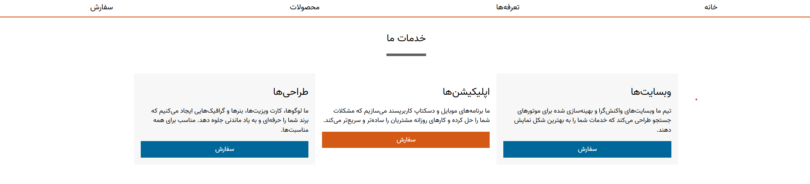
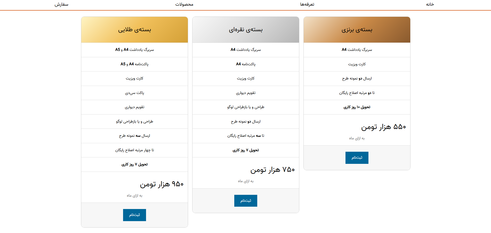
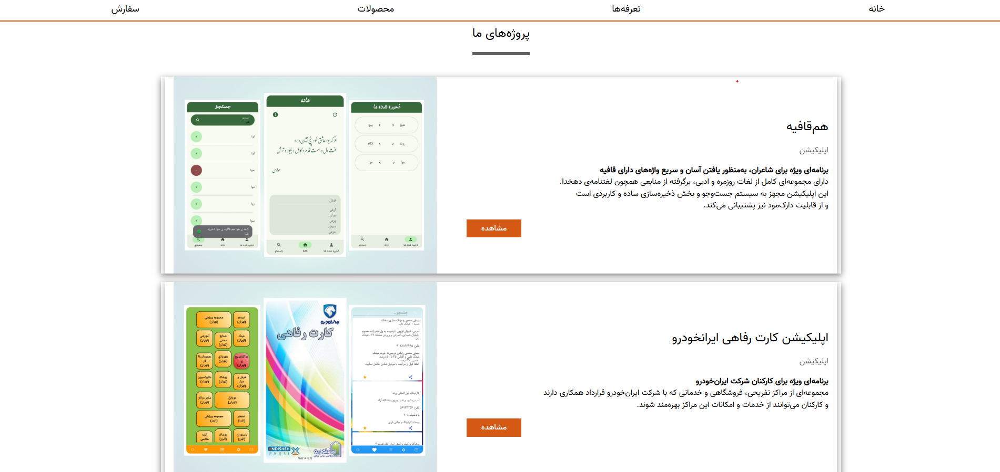
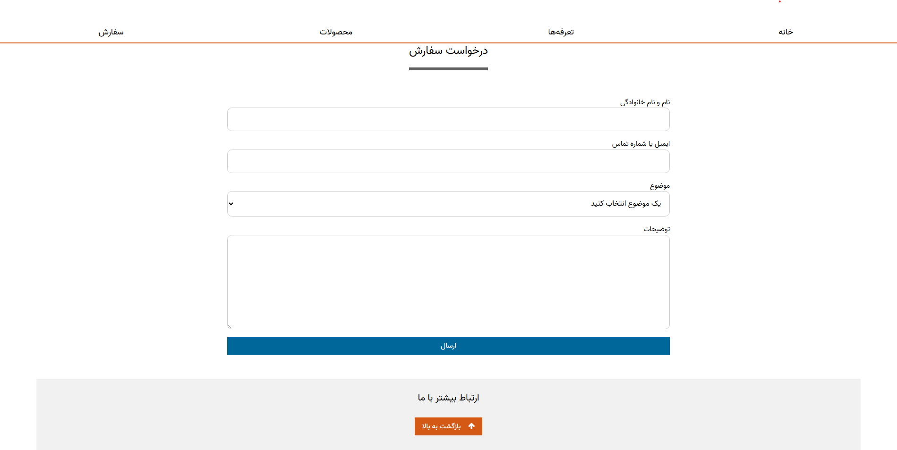

# 🧠 Andisheh Parsi Ikad Website

> A beginner web development project created as part of a ***university assignment***.

---

## 🚀 About
This repository contains the source code for the **Andisheh-Parsi-Ikad Website**, a static website built with **HTML, CSS, and assets** such as images and fonts. It was developed as a student project to practice core frontend-backend skills like layout design, responsive structure, and organizing pages. This website is an commercial website for a develope/design team.

---

## 🖼️ screenshots

>Home screen with a dynamic and automatic sideshow that presents the many projects and designs of this team.
---

>Descriptions of many products this team provides. With an easy access button to a *"order"* option. 
---

>Many pricings that this team requires. Differs depending on *clients' requests*.
---

>Some examples of the android projects that have been published as **android applications**.
---

>Users can easily order a request here. The operators will contact the user via the **contact information** that is necessary here in this option.
---

### 👇The link to the **Andisheh Parsi Ikad** website
### 🌐 [click here to check it out.](https://motamedkia.github.io/Andisheh-Parsi-Ikad-website/)
